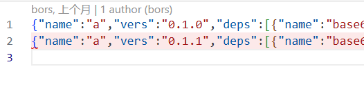

# 获取crates.io 上的所有 crate 源代码

## 自己创建文件，但需要在此处说明每个文件的作用（以及运行方式）

1. README.md : 项目介绍
2. 待补充

## 相关资源

crates.io : https://crates.io

数据获取方式：https://crates.io/data-access 主要关注于 Crate index、Database dumps、Api、Legacy Git crate index获取方式

## 主要任务

- 获取所有的crates的name情况列表

1、通过https://github.com/rust-lang/crates.io-index 先下载一份crate列情况（注意他的文件目录划分规则，文件过多的时候就是这样存储的，后面爬下来的源码信息我们也这样存储）；

里面的文件里有所有的crate的name情况。先从这里抽出来一张表（csv的就行），表的列是 crate name(名字)、crate version（版本号），其他信息不需要。

如1/a中的内容是：

抽出信息：name和vers就行

2、通过Crate index数据获取方式从cratesio获取所有的crate的源代码

通过https://index.crates.io/{crate}/{version} 来获取源代码。如：https://index.crates.io/base64/0.12.0

获取源代码需要知道 crate name 和 crate version（这里上一步我们已经做到），这里需要考虑的是要做并发请求（自己在本地不需要全部下载下来，可能有100多G。能运行几分钟看看能下载多少，能运行的话并且速度可以的话就行了，到时候我要部署到服务器上跑）

注意下载下来的文件  最好按任务一中下载的文件名分类命名，这样计算机检索速度会更快

- 可以先用python等语言写一个快速实现的代码获取脚本，不需要想的太复杂，能跑就行

后期需要再转为Rust重写，后面需要数据库设计+其他信息（不在这里）的存储处理（目前的版本不考虑，怎末快怎末来）

- 注意

代码中的“有些字段”不要写死再代码逻辑中，要从配置文件中读取或者写一个全局变量放在最上面，方便后续修改。（如：文件存储的地址根目录、文件读取的根目录）。
